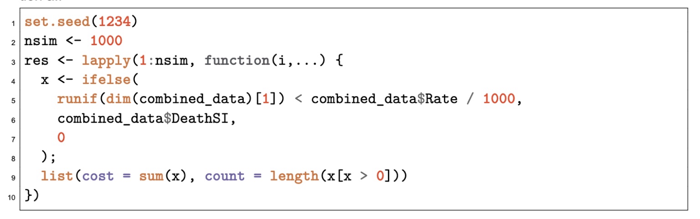

*Load in the important libraries.*

```{r}
library(mice)
library(Rtsne)
library(umap)
library(here)
library(purrr)
library(tidyverse)
library(dplyr)
library(tidyr)
library(ggplot2)
library(lubridate)
```

## ***Problem 1 – Data handling, analysis and plotting***

*The first problem of the case study builds on the data in the files p01-02_portfolio.csv and p01-02_rates.csv. One file contains membership information for a Group Life portfolio and one has information on the rates which should be charged.*

```{r}
# Load the CSV file
portfolio_data <- read_delim(
  "Case Study/data/p01-02_portfolio.csv",
  delim = ";",
  show_col_types = FALSE
)

# View the data
head(portfolio_data)
```

```{r}
# Load the CSV file
rates_data <- read_delim("Case Study/data/p01-02_rates.csv",
                         delim = ";",
                         show_col_types = FALSE)

# View the data
head(rates_data)
```

*rates_data*

```{r}
# Count occurrences of each combination of Gender and Age
duplicates <- rates_data %>%
  group_by(Gender, Age) %>%
  summarise(count = n()) %>%
  filter(count > 1)

# Check if any duplicates exist
if (nrow(duplicates) == 0) {
  message("Sanity Check Passed: 'Gender' and 'Age' form a unique key.")
} else {
  message("Sanity Check Failed: There are duplicate combinations of 'Gender' and 'Age'.")
  print(duplicates)
}
```

### ***Question a.***

*Read the data from the two files into R’s memory. The rates are applicable to each individual in the portfolio, depending on that individual’s age and gender. Combine the two datasets into a single table by looking up the rate for each line of the portfolio.*

```{r}
# Step 1: Convert the Date.of.Birth column to Date format
# dmy is used for "day-month-year" format
portfolio_data$Date.of.Birth <- dmy(portfolio_data$Date.of.Birth)

# Step 2: Calculate the time difference in years
portfolio_data$age <- ceiling(interval(portfolio_data$Date.of.Birth, today()) / years(1))

# Step 3: View the updated data with age column
head(portfolio_data)
```

### Extrapolate Rates Data beyond 70 years

```{r}
# Create the line plot with grouping by Gender
ggplot(rates_data, aes(
  x = Age,
  y = Rate,
  color = Gender,
  group = Gender
)) +
  geom_line(linewidth = 1) +  # Use linewidth instead of size
  scale_color_manual(values = c("F" = "red", "M" = "blue")) +  # Set colors for genders
  labs(title = "Rate vs Age by Gender", x = "Age", y = "Rate") +
  theme_minimal()  # Use a clean theme for the plot
```

### Fit an Exponential Model for Each Gender

```{r}
# Fit an exponential model for each gender
exp_model_female <- nls(Rate ~ exp(a + b * Age), data = subset(rates_data, Gender == "F"), start = list(a = 0, b = 0))
exp_model_male <- nls(Rate ~ exp(a + b * Age), data = subset(rates_data, Gender == "M"), start = list(a = 0, b = 0))

# Summarize the models
summary(exp_model_female)
summary(exp_model_male)
```

### **Plot the Data and the Fitted Exponential Curves**

```{r}
# Generate new data for ages 0 to 90 for both genders
new_data <- data.frame(Age = rep(0:90, 2), Gender = rep(c("F", "M"), each = 91))

# Predict rates for the new data using the fitted models
new_data$Rate_pred <- ifelse(
  new_data$Gender == "F",
  predict(exp_model_female, newdata = subset(new_data, Gender == "F")),
  predict(exp_model_male, newdata = subset(new_data, Gender == "M"))
)

# Plot the original data along with the fitted exponential curves
ggplot() +
  geom_line(
    data = new_data,
    aes(x = Age, y = Rate_pred, color = Gender),
    linewidth = 1,
    linetype = "dashed"
  ) +  # Fitted lines for each gender
  geom_point(data = rates_data, aes(x = Age, y = Rate, color = Gender)) +  # Original data points
  scale_color_manual(values = c("F" = "red", "M" = "blue")) +  # Set colors for genders
  labs(title = "Rate vs Age by Gender with Fitted Exponential Models", x = "Age", y = "Rate") +
  theme_minimal()
```

### Add Extrapolated Values to Rates Data

```{r}
# Get the unique values from the Gender column
unique_genders <- unique(rates_data$Gender)

# Print the unique values
unique_genders

# Get the unique values from the Gender column
unique_genders <- unique(portfolio_data$Gender)

# Print the unique values
unique_genders

# Convert "Male" to "M" and "Female" to "F" using ifelse
portfolio_data$Gender <- ifelse(
  portfolio_data$Gender == "Male",
  "M",
  ifelse(portfolio_data$Gender == "Female", "F", portfolio_data$Gender)
)

# Get the unique values from the Gender column
unique_genders <- unique(portfolio_data$Gender)

# Print the unique values
unique_genders
```

```{r}
# Step 1: Create a complete sequence of ages from 1 to 110 for both genders
complete_ages <- expand.grid(Age = 1:126, Gender = c("F", "M"))

# Step 2: Identify missing "Age" and "Gender" combinations in the existing data
# Perform an anti-join to find missing combinations (from dplyr)
missing_ages <- anti_join(complete_ages, rates_data, by = c("Age", "Gender"))

# Step 3: Predict the rates for the missing combinations using the fitted models
missing_ages$Rate <- ifelse(
  missing_ages$Gender == "F",
  predict(exp_model_female, newdata = subset(missing_ages, Gender == "F")),
  predict(exp_model_male, newdata = subset(missing_ages, Gender == "M"))
)

# Step 4: Append the new data (with missing combinations filled) to the existing data
rates_data_extended <- rbind(rates_data, missing_ages)
```

```{r}
# Create the line plot with grouping by Gender
ggplot(rates_data_extended,
       aes(
         x = Age,
         y = Rate,
         color = Gender,
         group = Gender
       )) +
  geom_line(linewidth = 1) +  # Use linewidth instead of size
  scale_color_manual(values = c("F" = "red", "M" = "blue")) +  # Set colors for genders
  labs(title = "Rate vs Age by Gender", x = "Age", y = "Rate") +
  theme_minimal()  # Use a clean theme for the plot
```

```{r}
# Inner join the two datasets
combined_data <- inner_join(portfolio_data,
                            rates_data_extended,
                            by = c("age" = "Age", "Gender" = "Gender"),
)

# Check if the row count of the joined data matches the original portfolio data
if (nrow(combined_data) == nrow(portfolio_data)) {
  message("Sanity Check Passed: The row count of combined_data matches portfolio_data.")
} else {
  message("Sanity Check Failed: The row count of combined_data does not match portfolio_data.")
  message("Rows in portfolio_data: ", nrow(portfolio_data))
  message("Rows in combined_data: ", nrow(combined_data))
}

# Get the unique values in the SchemeName column
unique_schemes <- unique(combined_data$SchemeName)
unique_schemes
```

#### *Investigate missing matches*

```{r}
# Find rows in portfolio_data that do not have a match in rates_data
missing_matches <- anti_join(portfolio_data,
                             rates_data_extended,
                             by = c("age" = "Age", "Gender" = "Gender"))

# Check how many rows are missing
nrow(missing_matches)
```

### ***Question b.***

*Group the Industry field into common-sense based groupings and determine the mean, standard deviation and quantiles of DeathSI for each of your industry groups.*

```{r}
industry_counts <- combined_data %>%
  count(Industry) %>%
  arrange(desc(n))

# View the result
print(industry_counts)
```

```{r}
combined_data <- combined_data %>%
  mutate(
    Industry_Group = case_when(
      Industry %in% c("Government & Public Administration", "Ex-Services Club") ~ "Government and Public Services",
      Industry %in% c(
        "Sporting Club",
        "Golf Club",
        "Bowls Club",
        "Registered Club",
        "Surf Life Saving Club",
        "Workers Club",
        "Australian Rules Football Club",
        "Leagues Club",
        "Associated with Club Industry"
      ) ~ "Clubs and Associations",
      Industry %in% c(
        "BSS-Business Services",
        "FIN-Finance & Insurance",
        "Professional Services",
        "LAW-Solicitors/Barrister",
        "ENG-Engineers",
        "MGE-Medical Services Gen"
      ) ~ "Professional and Business Services",
      Industry %in% c(
        "MAN-Manufacturing",
        "CON-Construction",
        "ELE-Electricians",
        "VEH-Vehicle Industry",
        "WEO-Wholesale Trades"
      ) ~ "Manufacturing, Construction, and Trades",
      Industry %in% c(
        "EDN-Education",
        "HEA-Health Industry",
        "MGE-Medical Services Gen"
      ) ~ "Education and Health",
      Industry %in% c(
        "RTL-Retail Trade",
        "ACR-Accom. Cafes & Rests",
        "FOO-Food",
        "Hospitality"
      ) ~ "Retail, Hospitality, and Food",
      Industry %in% c("AGR-Farming/Agriculture", "EGW
-Electric/Gas/Water") ~ "Agriculture and Utilities",
Industry == "Other" ~ "Other",
TRUE ~ "Uncategorized"  # Catch any uncategorized industries
    )
  )


# View the newly grouped data
print(combined_data)
```

```{r}
industry_counts <- combined_data %>%
  count(Industry_Group) %>%
  arrange(desc(n))

# View the result
print(industry_counts)
```

1.  <div>

    ```{r}
    # Check the type of DeathSI
    typeof(combined_data$DeathSI)

    # Count the number of NA values in DeathSI when it was character type
    na_count <- sum(is.na(combined_data$DeathSI))
    na_count

    # Count the number of "NA" string values in DeathSI when it was character type
    na_string_count <- sum(combined_data$DeathSI == "NA", na.rm = TRUE)
    na_string_count

    # Remove apostrophes and convert the DeathSI column from character to numeric
    combined_data$DeathSI <- as.numeric(gsub("'", "", combined_data$DeathSI))

    # Check the type of DeathSI
    typeof(combined_data$DeathSI)

    # Count the number of NA values in DeathSI when it is the double type
    na_count <- sum(is.na(combined_data$DeathSI))
    na_count
    ```

    </div>

```{r}
# Calculate mean, standard deviation, and quantiles for each industry group
summary_stats <- combined_data %>%
  group_by(Industry_Group) %>%
  summarize(
    mean_value = mean(DeathSI, na.rm = TRUE),
    sd_value = sd(DeathSI, na.rm = TRUE),
    q25 = quantile(DeathSI, 0.25, na.rm = TRUE),
    median_value = median(DeathSI, na.rm = TRUE),
    q75 = quantile(DeathSI, 0.75, na.rm = TRUE)
  )

# View the result
print(summary_stats)
```

## **Question c.**

The following code performs a Monte Carlo simulation on the data you have loaded and combined in Question a.:



Apply this simulation to each scheme in the dataset you were provided, running 1000 simulations per scheme. Produce a plot of the simulated outcomes (“cost”). Your plot should show:

-   a separate histogram per scheme;

-   all 5 histograms below each other so that they can be easily compared;

-   vertical lines in each graph indicating the median, mean and 99.5th percentile of each distribution.

### Remove rows where DeathSI is NA for Monte Carlo simulation.

```{r}
# Get the number of rows in the original dataset
original_row_count <- nrow(combined_data)

# Subset combined_data where DeathSI is not NA
combined_data_death_si_non_na <- subset(combined_data, !is.na(DeathSI))

# Get the number of rows in the filtered dataset
filtered_row_count <- nrow(combined_data_death_si_non_na)

# Print out the row counts to validate reduction
cat("Original row count:", original_row_count, "\n")
cat("Filtered row count (DeathSI not NA):", filtered_row_count, "\n")

# Check if the row count was reduced
if (filtered_row_count < original_row_count) {
  cat("Row reduction validated: Rows were reduced after filtering.\n")
} else {
  cat("No row reduction: No NA values in DeathSI.\n")
}
```

```{r}
monte_carlo_simulation <- function(data, nsim = 1000, seed = 1234) {
  # Set the seed for reproducibility
  set.seed(seed)
  
  # Perform the simulation
  res <- lapply(1:nsim, function(i, ...) {
    x <- ifelse(runif(dim(data)[1]) < data$Rate / 1000, data$DeathSI, 0)
    # Return the cost and count as a list
    list(cost = sum(x), count = length(x[x > 0]))
  })
  
  # Return the result of the simulation
  return(res)
}

# Get the unique values in the SchemeName column
unique_schemes <- unique(combined_data$SchemeName)

# Print the unique values
unique_schemes

# Filter rows where SchemeName is "Scheme_1", "Scheme_2", "Scheme_3", "Scheme_4", "Scheme_5"
combined_data_scheme_1 <- subset(combined_data_death_si_non_na, SchemeName == "Scheme1")
combined_data_scheme_2 <- subset(combined_data_death_si_non_na, SchemeName == "Scheme2")
combined_data_scheme_3 <- subset(combined_data_death_si_non_na, SchemeName == "Scheme3")
combined_data_scheme_4 <- subset(combined_data_death_si_non_na, SchemeName == "Scheme4")
combined_data_scheme_5 <- subset(combined_data_death_si_non_na, SchemeName == "Scheme5")

# Sanity check that each subset has more than 0 rows
check_scheme_1 <- nrow(combined_data_scheme_1) > 0
check_scheme_2 <- nrow(combined_data_scheme_2) > 0
check_scheme_3 <- nrow(combined_data_scheme_3) > 0
check_scheme_4 <- nrow(combined_data_scheme_4) > 0
check_scheme_5 <- nrow(combined_data_scheme_5) > 0

# Print the results
cat("Scheme 1 has more than 0 rows:", check_scheme_1, "\n")
cat("Scheme 2 has more than 0 rows:", check_scheme_2, "\n")
cat("Scheme 3 has more than 0 rows:", check_scheme_3, "\n")
cat("Scheme 4 has more than 0 rows:", check_scheme_4, "\n")
cat("Scheme 5 has more than 0 rows:", check_scheme_5, "\n")

# Perform a monte carlo simulation for each scheme
monte_carlo_scheme_1_result <- monte_carlo_simulation(combined_data_scheme_1)
monte_carlo_scheme_2_result <- monte_carlo_simulation(combined_data_scheme_2)
monte_carlo_scheme_3_result <- monte_carlo_simulation(combined_data_scheme_3)
monte_carlo_scheme_4_result <- monte_carlo_simulation(combined_data_scheme_4)
monte_carlo_scheme_5_result <- monte_carlo_simulation(combined_data_scheme_5)
```

```{r}
# Assuming you have 5 Monte Carlo simulation results, stored in a list
monte_carlo_results <- list(
  scheme_1 = monte_carlo_scheme_1_result,
  scheme_2 = monte_carlo_scheme_2_result,
  scheme_3 = monte_carlo_scheme_3_result,
  scheme_4 = monte_carlo_scheme_4_result,
  scheme_5 = monte_carlo_scheme_5_result
)

# Create an empty data frame to hold all the costs and corresponding scheme names
all_costs_data <- data.frame()

# Loop over each result and calculate costs, then combine into one data frame
for (scheme_name in names(monte_carlo_results)) {
  costs <- sapply(monte_carlo_results[[scheme_name]], function(x)
    x$cost)
  temp_data <- data.frame(Cost = costs, Scheme = scheme_name)
  all_costs_data <- rbind(all_costs_data, temp_data)
}

all_stats <- all_costs_data %>%
  group_by(Scheme) %>%
  summarise(
    mean_cost = mean(Cost),
    median_cost = median(Cost),
    percentile_99_5_cost = quantile(Cost, 0.995)
  )

# Create different x and y positions for each label depending on the scheme
all_stats <- all_stats %>%
  mutate(
    # Dynamic x positions for each scheme
    x_position_mean = ifelse(
      Scheme == "scheme_1",
      3e+07,
      ifelse(
        Scheme == "scheme_2",
        3e+07,
        ifelse(
          Scheme == "scheme_3",
          3e+07,
          ifelse(Scheme == "scheme_4", 3e+07, 3e+07)
        )
      )
    ),
    x_position_median = x_position_mean + 0.5e+06,
    # Offset for median
    x_position_995 = x_position_mean - 0.5e+06,
    # Offset for 99.5th percentile
    
    # Dynamic y positions for each scheme
    y_position_mean = ifelse(
      Scheme == "scheme_1",
      100,
      ifelse(
        Scheme == "scheme_2",
        400,
        ifelse(Scheme == "scheme_3", 325, ifelse(Scheme == "scheme_4", 325, 325))
      )
    ),
    y_position_median = ifelse(
      Scheme == "scheme_1",
      150,
      ifelse(
        Scheme == "scheme_2",
        500,
        ifelse(Scheme == "scheme_3", 425, ifelse(Scheme == "scheme_4", 425, 425))
      )
    ),
    y_position_995 = ifelse(
      Scheme == "scheme_1",
      200,
      ifelse(
        Scheme == "scheme_2",
        600,
        ifelse(Scheme == "scheme_3", 525, ifelse(Scheme == "scheme_4", 525, 525))
      )
    ),
  )

# Create the faceted plot with adjusted x and y positions for each level in the stack
ggplot(all_costs_data, aes(x = Cost)) +
  geom_histogram(bins = 30,
                 fill = "blue",
                 alpha = 0.7) +  # Set the number of bins
  # Add vertical lines for mean, median, and 99.5th percentile
  geom_vline(
    data = all_stats,
    aes(xintercept = mean_cost),
    color = "red",
    linetype = "dashed",
    size = 1
  ) +
  geom_vline(
    data = all_stats,
    aes(xintercept = median_cost),
    color = "green",
    linetype = "dashed",
    size = 1
  ) +
  geom_vline(
    data = all_stats,
    aes(xintercept = percentile_99_5_cost),
    color = "purple",
    linetype = "dashed",
    size = 1
  ) +
  
  # Add labels with dynamically adjusted x and y positions for each scheme
  geom_label(
    data = all_stats,
    aes(
      x = x_position_mean,
      y = y_position_mean,
      label = paste("Mean:", round(mean_cost, 2))
    ),
    color = "white",
    fill = "red",
    size = 2,
    angle = 0,
    vjust = 2,
    hjust = 0.5
  ) +
  geom_label(
    data = all_stats,
    aes(
      x = x_position_median,
      y = y_position_median,
      label = paste("Median:", round(median_cost, 2))
    ),
    color = "white",
    fill = "green",
    size = 2,
    angle = 0,
    vjust = 2,
    hjust = 0.5
  ) +
  geom_label(
    data = all_stats,
    aes(
      x = x_position_995,
      y = y_position_995,
      label = paste("99.5%:", round(percentile_99_5_cost, 2))
    ),
    color = "white",
    fill = "purple",
    size = 2,
    angle = 0,
    vjust = 2,
    hjust = 0.5
  ) +
  
  # Facet the plot vertically for each scheme
  facet_grid(Scheme ~ ., scales = "free_y") +
  labs(title = "Histogram of Monte Carlo Simulation Costs by Scheme", x = "Cost", y = "Frequency") +
  theme_minimal()
```

## **Problem 2 – Statistical learning**		

The following code loads the data used in Problem 2. The data is stored in two .csv files containing a data
set and a scoring set, respectively. These data are NOT related to Problem 1.


The goal of this problem is to predict the value of the variable outcome in the dataset defined above. The
measure of goodness of fit is the area under the receiver operating characteristic curve (AUC) and will be
measured on the scoring set.

```{r}
dta <- read_csv(
  here("Case Study/data/p02re_data.csv"),
  col_types = cols()
)

scoring <- read_csv(
  here("Case Study/data/p02re_scoring.csv"),
  col_types = cols()
)

head(dta)
head(scoring)
```

```{r}
unique_values <- sort(unique(dta$group))
print(unique_values)

unique_values <- sort(unique(scoring$group))
print(unique_values)
```

```{r}
# For the first dataset (dta)
dta_percent <- dta %>%
  group_by(group) %>%
  summarise(count = n()) %>%
  mutate(percentage = count / sum(count) * 100, dataset = "dta")

# For the second dataset (scoring)
scoring_percent <- scoring %>%
  group_by(group) %>%
  summarise(count = n()) %>%
  mutate(percentage = count / sum(count) * 100, dataset = "scoring")

# Combine both datasets
combined_data <- bind_rows(dta_percent, scoring_percent)

ggplot(combined_data, aes(x = group, y = percentage, fill = dataset)) +
  geom_bar(stat = "identity", position = "dodge") +  # side-by-side bars
  labs(title = "Distribution of Group in dta and scoring datasets", x = "Group", y = "Percentage") +
  theme_minimal()
```

#### **Observation:** The "scoring" set contains a different Group, C, from the "dta" set containing the group, D. It may be worth checking to see if the Groups from both datasets derive from the same distribution or if the naming is erroneous. 

Perform the KS-test across distributions:

```{r}
# Define the groups you want to check
groups <- c("a", "b", "e", "f", "g")

# Function to perform the KS test for a single group
perform_ks_test <- function(grp) {
  filtered_dta <- dta %>% filter(group == grp)
  filtered_scoring <- scoring %>% filter(group == grp)
  
  # Apply KS test only for numeric columns
  ks_results <- map_dbl(names(filtered_dta), function(col) {
    if (is.numeric(filtered_dta[[col]]) &&
        is.numeric(filtered_scoring[[col]])) {
      ks.test(filtered_dta[[col]], filtered_scoring[[col]])$p.value
    } else {
      NA_real_  # Return NA for non-numeric columns
    }
  })
  
  # Display results
  cat("\nGroup:", grp, "\n")
  print(ks_results)
  
  # Check if any p-values are below 0.05
  if (any(ks_results < 0.05, na.rm = TRUE)) {
    cat("\nGroup",
        grp,
        "shows a significant difference in distribution.\n")
  } else {
    cat(
      "\nNot enough information to suggest that Group",
      grp,
      "comes from a different distribution.\n"
    )
  }
}

# Use purrr::walk to apply the function for each group
walk(groups, perform_ks_test)
```

```{r}
filtered_dta <- dta %>% filter(group == "d")
filtered_scoring <- scoring %>% filter(group == "c")

# Apply KS test only for numeric columns
ks_results <- sapply(names(filtered_dta), function(col) {
  if (is.numeric(filtered_dta[[col]]) &&
      is.numeric(filtered_scoring[[col]])) {
    ks.test(filtered_dta[[col]], filtered_scoring[[col]])$p.value
  } else {
    NA  # If column is not numeric, return NA
  }
})

# View results
ks_results
```

Check Missing Values and Perform Imputation Technique

```{r}
# Function to get and display missing value counts for a dataset
display_na_counts <- function(dataset, name) {
  na_counts <- sapply(dataset, function(x)
    sum(is.na(x)))
  cat(paste("Missing values in '", name, "':\n", sep = ""))
  print(na_counts)
  cat("\n")
}

# Display missing values before imputation
display_na_counts(dta, "dta")
display_na_counts(scoring, "scoring")

# Define imputation methods, excluding 'outcome' column from dta
method_dta <- make.method(dta)
method_dta["outcome"] <- ""

# Perform imputation on both datasets: KNN Imputation
dta_imputed <- mice(dta, method = method_dta, m = 5)
scoring_imputed <- mice(scoring, method = 'pmm', m = 5)

# Suppress any output while extracting the complete data after imputation
invisible(dta_complete <- complete(dta_imputed))
invisible(scoring_complete <- complete(scoring_imputed))

# Display missing values after imputation
display_na_counts(dta_complete, "dta (complete)")
display_na_counts(scoring_complete, "scoring (complete)")
```

Perform PCA to Visualize Groups

```{r}
dta_complete_group_renamed <- dta_complete %>%
  mutate(group = paste("dta_complete:", group))

scoring_complete_group_renamed <- scoring_complete %>%
  mutate(group = paste("scoring_complete:", group))

# Create a renamed copy of the data without the "outcome" field
dta_renamed <- dta_complete_group_renamed %>% select(-outcome)

# Combine dta_renamed and scoring vertically (row-wise)
combined_part_2_data <- bind_rows(dta_renamed, scoring_complete_group_renamed)

# Retain the 'group' column separately
group_column <- combined_part_2_data$group

# Select only the numeric columns for PCA (excluding 'group')
numeric_data <- combined_part_2_data %>% select(where(is.numeric))

# Perform PCA and reduce to 2 principal components
pca_result <- prcomp(numeric_data, center = TRUE, scale. = TRUE)

# Extract the first 2 principal components
pca_data <- as.data.frame(pca_result$x[, 1:2])

# Rename the principal components for clarity
colnames(pca_data) <- c("PC1", "PC2")

# Add the 'group' column back to the PCA data
pca_data_with_group <- cbind(group = group_column, pca_data)

# Create a 2D scatter plot with different colors for each group
ggplot(pca_data_with_group, aes(x = PC1, y = PC2, color = group)) +
  geom_point(size = 3) +
  labs(title = "PCA Plot with Clusters by Group",
       x = "Principal Component 1",
       y = "Principal Component 2") +
  theme_minimal() +
  theme(legend.title = element_blank())  # Remove legend title
```

```{r}
# Rename 'group' column in both datasets
dta_complete_group_renamed <- dta_complete %>%
  mutate(group = paste("dta_complete:", group))

scoring_complete_group_renamed <- scoring_complete %>%
  mutate(group = paste("scoring_complete:", group))

# Create a renamed copy of the data without the "outcome" field
dta_renamed <- dta_complete_group_renamed %>% select(-outcome)

# Combine dta_renamed and scoring_complete vertically (row-wise)
combined_part_2_data <- bind_rows(dta_renamed, scoring_complete_group_renamed)

# Retain the 'group' column separately
group_column <- combined_part_2_data$group

# Select only the numeric columns for t-SNE (excluding 'group')
numeric_data <- combined_part_2_data %>% select(where(is.numeric))

# Perform t-SNE on the numeric data
tsne_result <- Rtsne(
  numeric_data,
  dims = 2,
  perplexity = 30,
  verbose = FALSE
)

# Convert the t-SNE result into a data frame
tsne_data <- as.data.frame(tsne_result$Y)

# Rename the t-SNE components for clarity
colnames(tsne_data) <- c("TSNE1", "TSNE2")

# Add the 'group' column back to the t-SNE data
tsne_data_with_group <- cbind(group = group_column, tsne_data)

# Create a 2D scatter plot with different colors for each group
ggplot(tsne_data_with_group, aes(x = TSNE1, y = TSNE2, color = group)) +
  geom_point(size = 3) +
  labs(title = "t-SNE Plot with Clusters by Group", x = "t-SNE 1", y = "t-SNE 2") +
  theme_minimal() +
  theme(legend.title = element_blank())  # Remove legend title
```

```{r}
# Rename 'group' column in both datasets
dta_complete_group_renamed <- dta_complete %>%
  mutate(group = paste("dta_complete:", group))

scoring_complete_group_renamed <- scoring_complete %>%
  mutate(group = paste("scoring_complete:", group))

# Create a renamed copy of the data without the "outcome" field
dta_renamed <- dta_complete_group_renamed %>% select(-outcome)

# Combine dta_renamed and scoring_complete vertically (row-wise)
combined_part_2_data <- bind_rows(dta_renamed, scoring_complete_group_renamed)

# Retain the 'group' column separately
group_column <- combined_part_2_data$group

# Select only the numeric columns for UMAP (excluding 'group')
numeric_data <- combined_part_2_data %>% select(where(is.numeric))

# Perform UMAP on the numeric data
umap_result <- umap(numeric_data)

# Convert UMAP result into a data frame
umap_data <- as.data.frame(umap_result$layout)

# Rename the UMAP components for clarity
colnames(umap_data) <- c("UMAP1", "UMAP2")

# Add the 'group' column back to the UMAP data
umap_data_with_group <- cbind(group = group_column, umap_data)

# Create a 2D scatter plot with different colors for each group
ggplot(umap_data_with_group, aes(x = UMAP1, y = UMAP2, color = group)) +
  geom_point(size = 3) +
  labs(title = "UMAP Plot with Clusters by Group", x = "UMAP 1", y = "UMAP 2") +
  theme_minimal() +
  theme(legend.title = element_blank())  # Remove legend title
```

\_\_\_\_\_\_\_\_\_\_\_\_\_\_\_\_\_\_\_\_\_\_\_\_\_\_\_\_\_\_\_\_\_\_\_\_\_\_\_\_\_\_\_\_\_\_\_\_\_\_\_\_\_\_\_\_\_\_\_\_\_\_\_\_\_\_\_\_\_\_\_\_\_\_\_\_\_\_\_\_\_\_\_\_\_\_\_\_\_\_\_\_\_\_\_\_\_\_\_\_\_\_\_\_\_

**Question a.**

Describe the statistical learning problem. Explain the difficulties in training a model with the above dataset.
\_\_\_\_\_\_\_\_\_\_\_\_\_\_\_\_\_\_\_\_\_\_\_\_\_\_\_\_\_\_\_\_\_\_\_\_\_\_\_\_\_\_\_\_\_\_\_\_\_\_\_\_\_\_\_\_\_\_\_\_\_\_\_\_\_\_\_\_\_\_\_\_\_\_\_\_\_\_\_\_\_\_\_\_\_\_\_\_\_\_\_\_\_\_\_\_\_\_\_\_\_\_\_\_\_

This learning problem falls under **semi-supervised learning**, which combines labeled data (10,000 rows with targets from the "dta" set) with a smaller amount of unlabeled data (2,000 rows without targets from the "scoring" set). The goal is to leverage both to improve the model’s performance, typically by learning the structure of the data from the unlabeled dataset and refining predictions on the labeled dataset.

**Key Challenges:**

1.  **Handling Missing Values (NaNs in “R”)**: Missing data in the independent variable “R” will make it harder to apply some models directly. Techniques like imputation (e.g., mean, median, or model-based imputation) or excluding rows with missing values might be necessary. However, these methods can introduce bias or lead to information loss.

2.  **Bias Between Datasets**: The distribution of the features in your labeled and unlabeled datasets might differ. If the 2,000 rows (without a target) are from a different distribution than the 10,000 rows (with targets), the model may struggle to generalize well.

```{=html}
<!-- -->
```
3.  **Model Complexity**: Semi-supervised models often require complex techniques such as self-training, co-training, or graph-based methods to use the unlabeled data efficiently. These techniques can be computationally expensive and tricky to fine-tune.

4.  **Feature Engineering for Unlabeled Data**: Without a target in the 2,000-row dataset, extracting meaningful patterns is challenging. You may need to create features based on clustering, dimensionality reduction (e.g., PCA), or distance-based approaches to make the most of the unlabeled data.

5.  **Class Imbalance**: If there’s an imbalance in the target variable in your labeled dataset, the model might overfit to the more common class, especially with so much unlabeled data that has no class information to aid the minority class.

6.  **Semi-supervised Algorithms**: The choice of a semi-supervised algorithm, such as Label Propagation, Self-learning, or Generative Models, impacts how well you can use both datasets. Many conventional algorithms like decision trees or linear models won’t naturally extend to semi-supervised scenarios.

Each of these issues will need specific strategies for data preparation, model selection, and evaluation to get robust results.

\_\_\_\_\_\_\_\_\_\_\_\_\_\_\_\_\_\_\_\_\_\_\_\_\_\_\_\_\_\_\_\_\_\_\_\_\_\_\_\_\_\_\_\_\_\_\_\_\_\_\_\_\_\_\_\_\_\_\_\_\_\_\_\_\_\_\_\_\_\_\_\_\_\_\_\_\_\_\_\_\_\_\_\_\_\_\_\_\_\_\_\_\_\_\_\_\_\_\_\_\_\_\_\_\_

**Question b.**

Describe the statistical learning problem. Explain the difficulties in training a model with the above dataset.
\_\_\_\_\_\_\_\_\_\_\_\_\_\_\_\_\_\_\_\_\_\_\_\_\_\_\_\_\_\_\_\_\_\_\_\_\_\_\_\_\_\_\_\_\_\_\_\_\_\_\_\_\_\_\_\_\_\_\_\_\_\_\_\_\_\_\_\_\_\_\_\_\_\_\_\_\_\_\_\_\_\_\_\_\_\_\_\_\_\_\_\_\_\_\_\_\_\_\_\_\_\_\_\_\_
